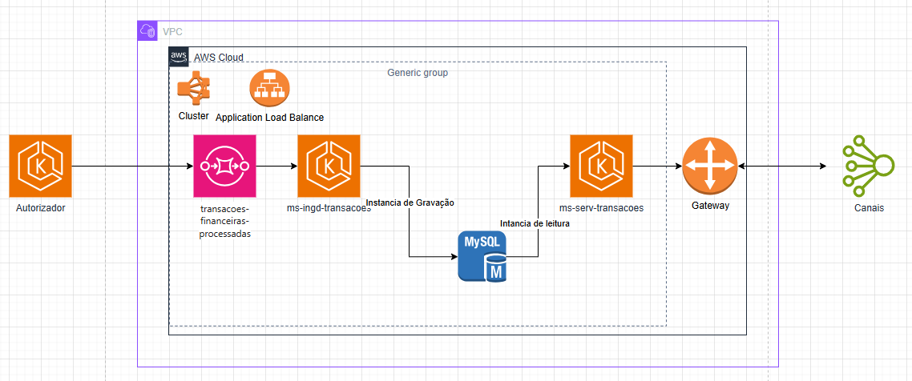

# Arquitetura

* Projeto na arquitetura Hexagonal
* Swagger via OpenApi
* Exception Handler Controller Advice
* MapperStruct
* Consulta ao Banco de dados MySQL
* Configurações Hikari para melhor perfomance

## Como utilizar
### Primeiro
- Subir o projeto dev-tools que fará o papel do autorizador e enviar mensagens conforme o endPoint existe para envio de mensagens.
- 
### Segundo
- Definir uma porta diferente do dev-tools e do ms-ingsd-transacoes, default: 8082;

### Terceito
- Rodar o projeto ms-serv-transacoes:
    - Swagger:
      * [http://localhost:8082/swagger-ui/index.html]

### Quarto
- Query para consultar os dados persistido:
    - select  a.id,
              a.owner,
              b.amount,
              b.currency,
              t.`timestamp` as updated_at
      from transaction t
        left join account a
            on a.id = t.account_id
        left join balance b
            on b.account_id = t.account_id;
### Quinto
- Realizar a requisição Http via Rest:
  - EndPoint é um POST é necessário passar o UUI via Body (Conforme o Swagger);